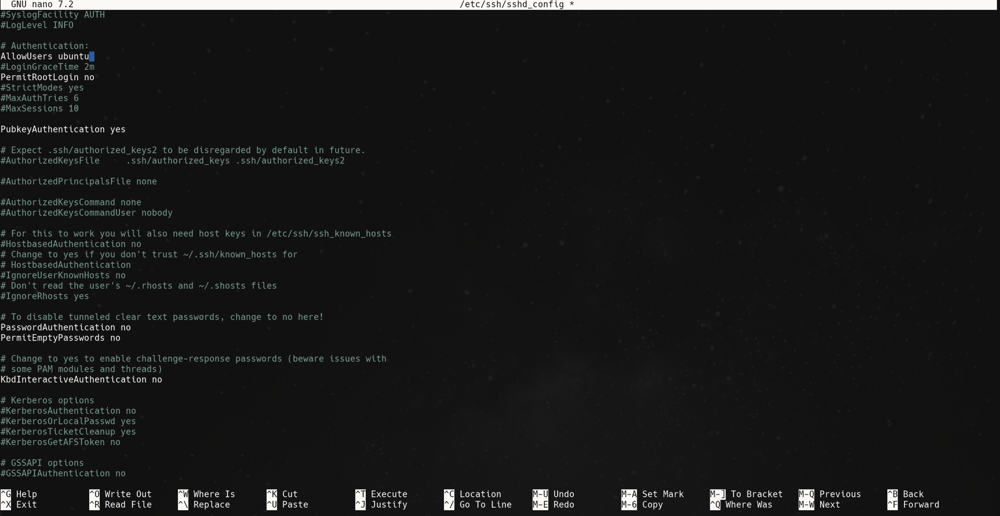
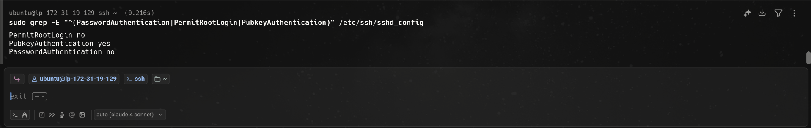

# Configure SSH key-based login, disable password authentication, and disable root login insshd_config.


## Step 1:
Backup SSH Config:
```bash
sudo cp /etc/ssh/sshd_config /etc/ssh/sshd_config.backup
```
Check current config:
```bash
sudo grep -E "^(PasswordAuthentication|PermitRootLogin|PubkeyAuthentication)" /etc/ssh/sshd_config
```
Edit SSH Config:
```bash
sudo nano /etc/ssh/sshd_config
```

Reload SSH config:
```bash
sudo systemctl reload sshd
```
Check status:
```bash
sudo systemctl status sshd
```
