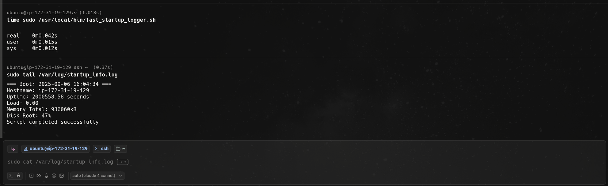
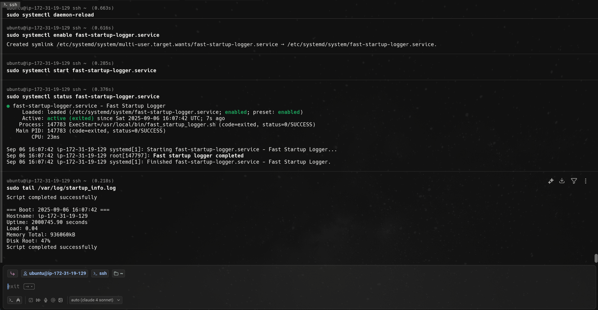

# Write a simple script and create a `systemd` service to run it automatically at boot.

## Step 1:
creat script:
```bash
sudo nano /usr/local/bin/startup_logger.sh
```
make the script executable:
```bash
sudo chmod +x /usr/local/bin/startup_logger.sh
```
test manually:
```bash
sudo /usr/local/bin/startup_logger.sh
```
check log file:
```bash
sudo cat /var/log/startup_info.log
```
check system log for message:
```bash
sudo grep "Startup logger script" /var/log/syslog
```


## Step 2:
Create service file:
```bash
sudo nano /etc/systemd/system/startup-logger.service
```
Add config:
```bash
[Unit]
Description=Startup Logger
After=local-fs.target

[Service]
Type=oneshot
ExecStart=/usr/local/bin/startup_logger.sh
RemainAfterExit=yes
TimeoutSec=30

[Install]
WantedBy=multi-user.target
```
Reload systemd:
```bash
sudo systemctl daemon-reload
```
Enable new service:
```bash
sudo systemctl enable startup-logger.service
```
Test manually:
```bash
sudo systemctl start startup-logger.service
```
check status:
```bash
sudo systemctl status startup-logger.service
```
check log:
```bash
sudo tail /var/log/startup_info.log
```

