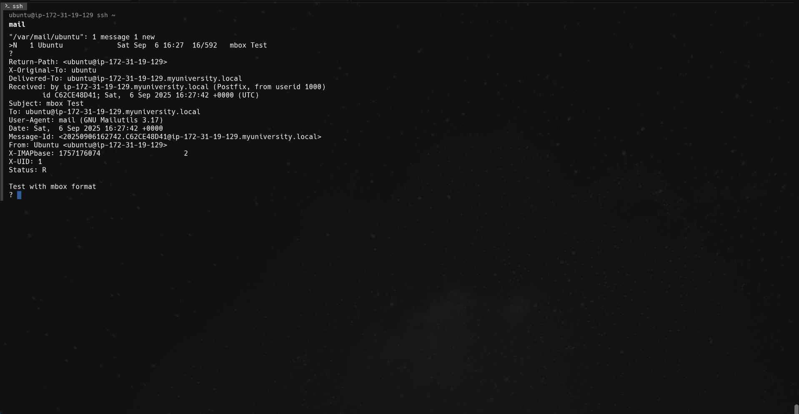

# Install and configure Postfix for local mail delivery and send a test mail between users.


## Step 1:
Install postfix:
```bash
sudo apt install postfix mailutils -y
```
During installation:
* Select localonly.
* keep default system mail name.
Check current postfix config:
```bash
sudo postconf -n
```
Edit config:
```bash
sudo nano /etc/postfix/main.cf
```
add:
```
home_mailbox = Maildir/
mailbox_command =
```
Restart, enable and check status of postfix:
```bash
# Restart
sudo systemctl restart postfix

# Enable
sudo systemctl enable postfix

# Check status
sudo systemctl status postfix
```

## Step 2:
Create 2 test users:
```bash
# First
sudo adduser testuser --disabled-password --gecos "Test User"

# Second
sudo adduser mailtest --disabled-password --gecos "Mail Test User"
```
Test locally and send mail accross users:
```bash
# from ubuntu to testuser
echo "This is a test message from ubuntu user." | mail -s "Test Mail 1" testuser

# from testuser to ubuntu
echo "Hello from the ubuntu user! This is a local mail test." | mail -s "Local Mail Test" mailtest

# self test
echo "Self test mail" | mail -s "Self Mail Test" ubuntu
```
Check mail for `ubuntu` user:
```bash
mail
```

