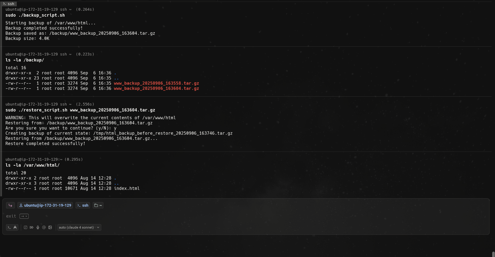

# Write a script to back up /var/www/html to /backup/ with a timestamp and test restoring.

## Step 1:
Create the script.
Make script executable:
```bash
chmod +x backup_script.sh
chmod +x restore_script.sh
```
Run backup script:
```bash
sudo ./backup_script.sh
```
Check available backups:
```bash
ls -la /backup/
```
Restore with file name:
```bash
sudo ./restore_script.sh
```
Verify restoration:
```bash
ls -la /var/www/html/
```
