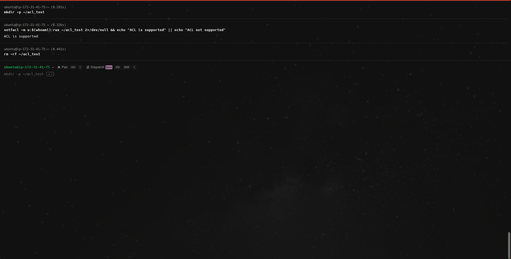
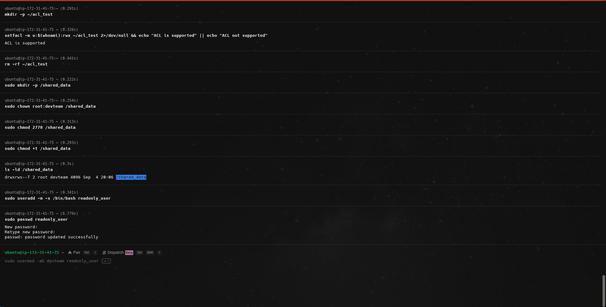
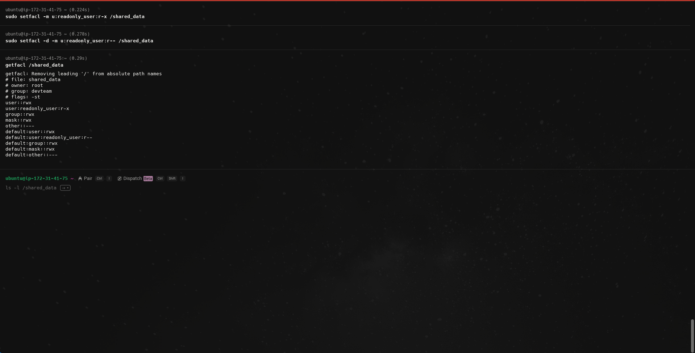

# Create a shared directory `/shared_data` where group members can read/write but not delete others' files. Use ACL to grant read-only access to one extra user outside the group.

## Step 1:
Test acl directly to see if it's available.

```bash
mkdir -p ~/acl_test
setfacl -m u:$(whoami):rwx ~/acl_test 2>/dev/null && echo "ACL is supported" || echo "ACL not supported"
rm -rf ~/acl_test
```
if it shows `Acl not supported`, install acl tools with:
```bash
sudo apt install acl
```


## Step 2:
Create shared directory:
```bash
sudo mkdir -p /shared_data
```
Set Ownership to root and devteam:
```bash
sudo chown root:devteam /shared_data
```

## Step 3:
Set Permissions: Owner (read/write/execute), Group (read/write/execute), Others (no access)

```bash
sudo chmod 2770 /shared_data
```

## Step 4:
Set the no delete rule:

```bash
sudo chmod +t /shared_data
```

verify rule:
```bash
ls -ld /shared_data
```

## Step 5:
Create user for readonly access:

```bash
sudo useradd -m -s /bin/bash readonly_user
```

Set Password:
```bash
sudo passwd readonly_user
```



## Step 6:
Grant readonly access to external user with acl:

```bash
sudo setfacl -m u:readonly_user:r-x /shared_data
```
Set default:
```bash
sudo setfacl -d -m u:readonly_user:r-- /shared_data
```
Verify acl configuration:
```bash
getfacl /shared_data
```

