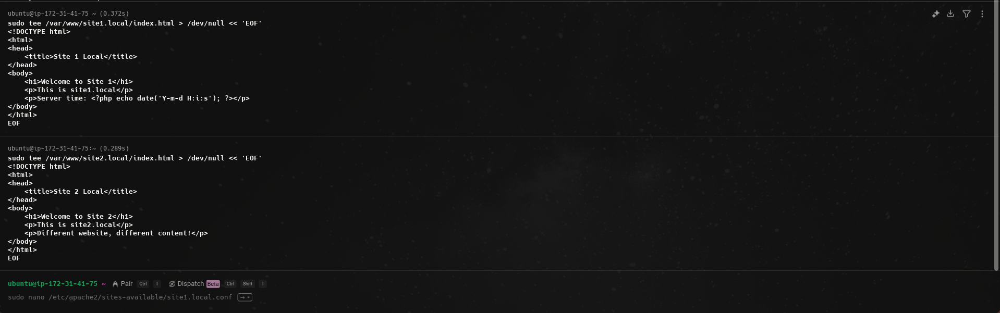
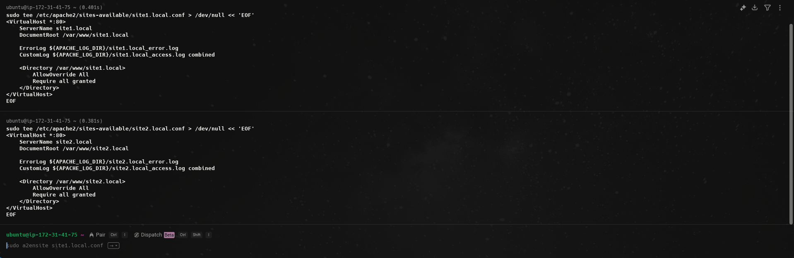

# Configure Apache to host two websites (site1.local, site2.local) with separate documentroots and logs.

## Step 1:
Install Apache
```bash
sudo apt install apache2
```
Start and enable Apache:
```bash
sudo systemctl start apache2
sudo systemctl enable apache2
sudo systemctl status apache2
```


## Step 2:
Create documents and root directories.

Create directories for both sites:
```bash
sudo mkdir -p /var/www/site1.local
sudo mkdir -p /var/www/site2.local
```

Set ownerships:
```bash
sudo chown -R www-data:www-data /var/www/site1.local
sudo chown -R www-data:www-data /var/www/site2.local
```

Set Permissions:
```bash
sudo chmod -R 755 /var/www/site1.local
sudo chmod -R 755 /var/www/site2.local
```


## Step 3:
Create files for each site:

Site 1 (Index.html):
```html
sudo tee /var/www/site1.local/index.html > /dev/null << 'EOF'
<!DOCTYPE html>
<html>
<head>
    <title>Site 1 Local</title>
</head>
<body>
    <h1>Welcome to Site 1</h1>
    <p>This is site1.local</p>
    <p>Server time: <?php echo date('Y-m-d H:i:s'); ?></p>
</body>
</html>
EOF
```

Site 2 (Index.html):
```html
sudo tee /var/www/site2.local/index.html > /dev/null << 'EOF'
<!DOCTYPE html>
<html>
<head>
    <title>Site 2 Local</title>
</head>
<body>
    <h1>Welcome to Site 2</h1>
    <p>This is site2.local</p>
    <p>Different website, different content!</p>
</body>
</html>
EOF
```



## Step 4:
Create site configurations:

Site 1:
```bash
sudo tee /etc/apache2/sites-available/site1.local.conf > /dev/null << 'EOF'
<VirtualHost *:80>
    ServerName site1.local
    DocumentRoot /var/www/site1.local
    
    ErrorLog ${APACHE_LOG_DIR}/site1.local_error.log
    CustomLog ${APACHE_LOG_DIR}/site1.local_access.log combined
    
    <Directory /var/www/site1.local>
        AllowOverride All
        Require all granted
    </Directory>
</VirtualHost>
```

Site 2:
```bash
sudo tee /etc/apache2/sites-available/site2.local.conf > /dev/null << 'EOF'
<VirtualHost *:80>
    ServerName site2.local
    DocumentRoot /var/www/site2.local
    
    ErrorLog ${APACHE_LOG_DIR}/site2.local_error.log
    CustomLog ${APACHE_LOG_DIR}/site2.local_access.log combined
    
    <Directory /var/www/site2.local>
        AllowOverride All
        Require all granted
    </Directory>
</VirtualHost>
EOF
```



## Step 5:
Configure Local DNS Resolution:

```bash
sudo tee -a /etc/hosts > /dev/null << 'EOF'
127.0.0.1    site1.local
127.0.0.1    site2.local
EOF
```

and Restart Apache:
```bash
sudo systemctl restart apache2
```


Step 6:
Test websites:
```bash
curl -H "Host: site1.local" http://localhost
curl -H "Host: site2.local" http://localhost


curl http://site1.local
curl http://site2.local
```

