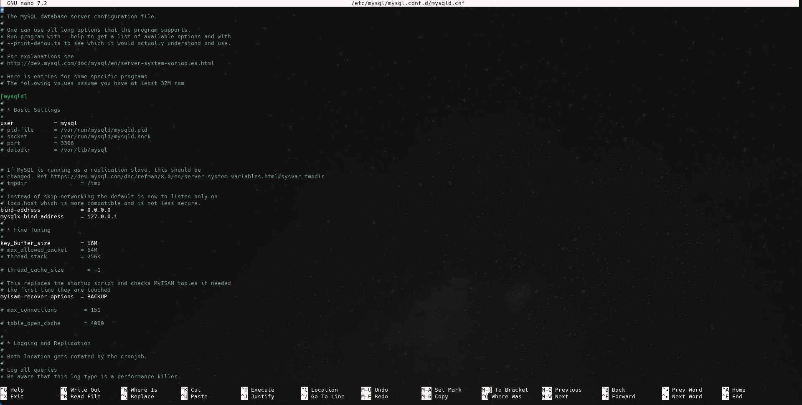
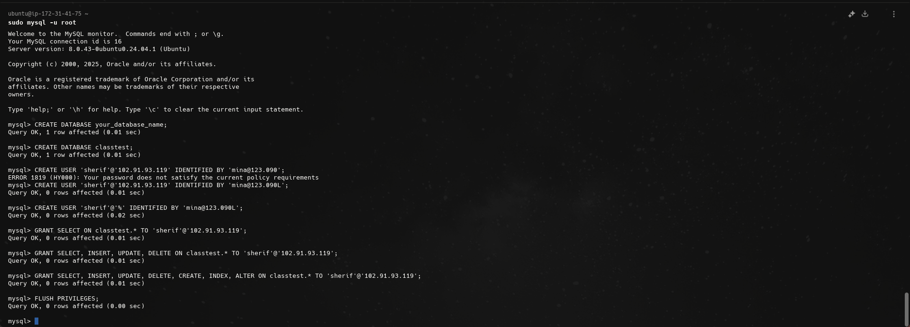

# Configure MySQL to allow secure remote connections, create a database and user with leastprivilege for remote access.

## Step 1:
Change the `bind address` in the conf file:
```bash
sudo nano /etc/mysql/mysql.conf.d/mysqld.cnf
```
To `0.0.0.0`:


Restart:
```bash
sudo systemctl restart mysql
```

## Step 2:
Open MySQL Port:
```bash
sudo ufw allow 3306
```
Run Security Script:
```bash
sudo mysql_secure_installation
```
And:
* Set root password
* Remove anonymous users
* Disable remote root login
* Remove test database
* Reload privilege tables


## Step 3:
Create database and user:
Login as root:
```bash
mysql -u root -p
```
If you don't know your password you can reset with:
```bash
sudo mysql -u root
   ALTER USER 'root'@'localhost' IDENTIFIED WITH 'mysql_native_password' BY 'your_password';
   FLUSH PRIVILEGES;
   exit;
```
Create database:
```bash
CREATE DATABASE classtest;
```
Create user with specific host access:
```bash
CREATE USER 'sherif'@'102.91.93.119' IDENTIFIED BY '**********';
```
Access from any ip:
```bash
CREATE USER 'sherif'@'%' IDENTIFIED BY '************';
```
Grant least access (read only):
```bash
GRANT SELECT ON classtest.* TO 'sherif'@'102.91.93.119';
```
For read-write access:
```bash
GRANT SELECT, INSERT, UPDATE, DELETE ON classtest.* TO 'sherif'@'102.91.93.119';
```
For application user:
```bash
GRANT SELECT, INSERT, UPDATE, DELETE, CREATE, INDEX, ALTER ON classtest.* TO 'sherif'@'102.91.93.119';
```
Apply changes:
```bash
FLUSH PRIVILEGES;
```
Exit:
```bash
EXIT;
```
