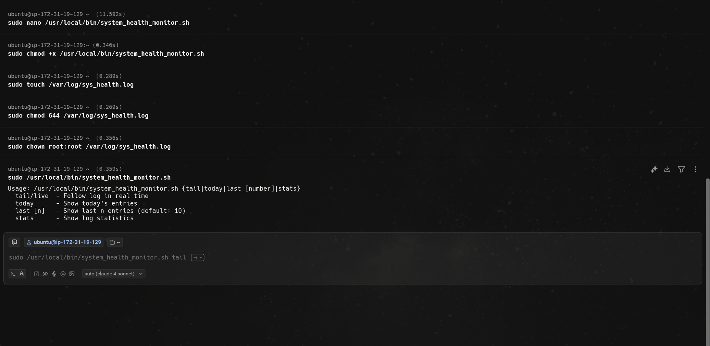
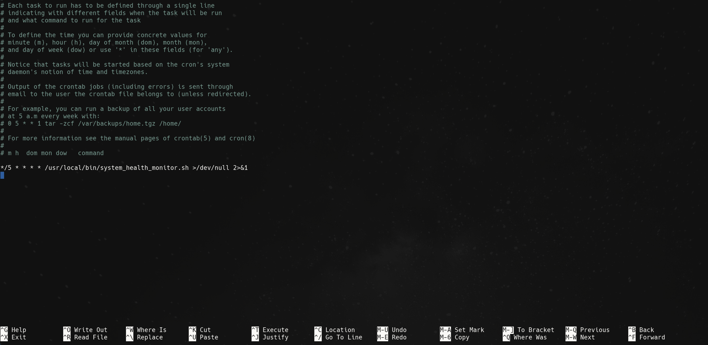
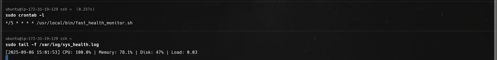

# Write a script to log CPU, Memory, and Disk usage every 5 minutes into /var/log/sys_health.log and set as a cron job.

## Step 1:
Create file and script:
```bash
sudo nano /usr/local/bin/system_health_monitor.sh
```
and make script executable:
```bash
sudo chmod +x /usr/local/bin/system_health_monitor.sh
```

## Step 2:
Create log file:
```bash
sudo touch /var/log/sys_health.log
```
Set Permissions:
```bash
sudo chmod 644 /var/log/sys_health.log
```
Change ownership to root:
```bash
sudo chown root:root /var/log/sys_health.log
```

## Step 3:
Test the script:
```bash
sudo /usr/local/bin/system_health_monitor.sh
```



## Step 4:
Set up CRON Job:
Open Crontab:
```bash
sudo crontab -e
```
Add the cron entry job:
```bash
*/5 * * * * /usr/local/bin/system_health_monitor.sh >/dev/null 2>&1
```


## Step 4:
Wait 5 minutes and verify:
```bash
sudo tail -f /var/log/sys_health.log
```
