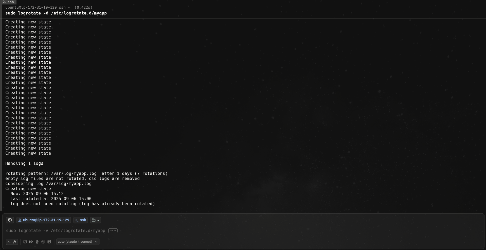

# Configure `logrotate` for a custom application log to rotate daily, compress old logs, andkeep only 7 days.

## Step 1:
Create test log file:
```bash
sudo touch /var/log/myapp.log
sudo chmod 644 /var/log/myapp.log
```
Add some test content:
```bash
echo "$(date) - Application started" | sudo tee -a /var/log/myapp.log
echo "$(date) - Test log entry" | sudo tee -a /var/log/myapp.log
```

## Step 2:
Create logrotate config file:
```bash
sudo nano /etc/logrotate.d/myapp
```
with configuration:
```bash
/var/log/myapp.log {
    daily
    rotate 7
    compress
    delaycompress
    missingok
    notifempty
    copytruncate
    su root root
}
```
Test the configuration:
```bash
sudo logrotate -d /etc/logrotate.d/myapp
```

