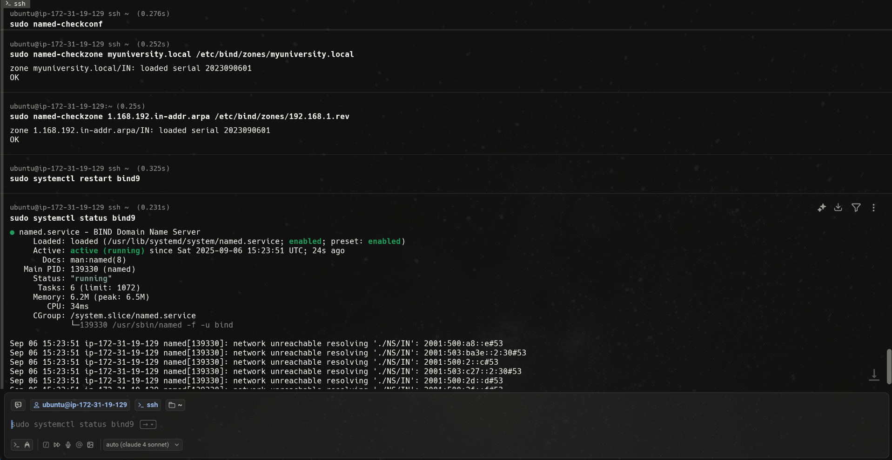
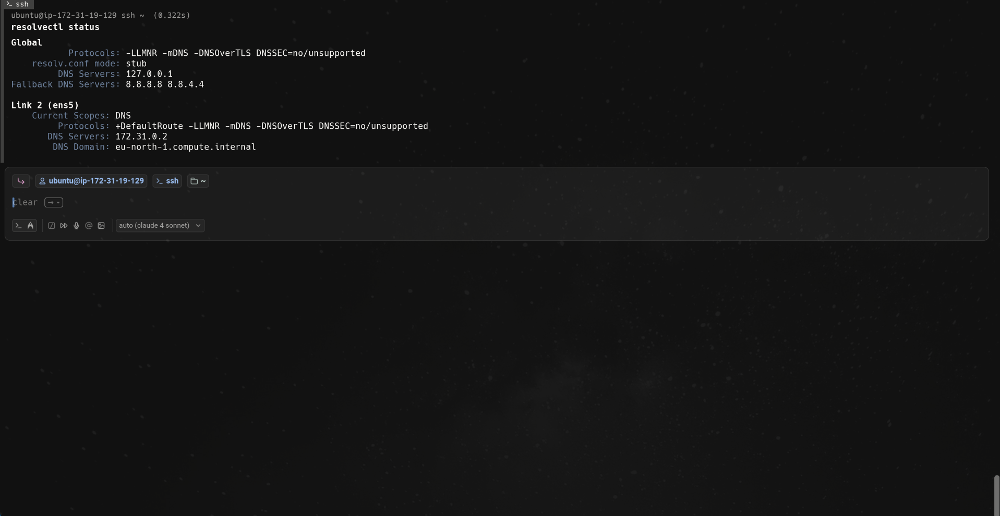
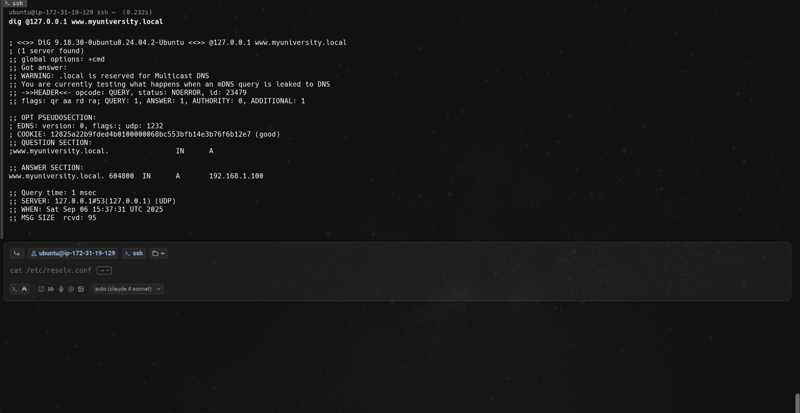

# Install and configure `bind9` as a local caching DNS server with a custom zone for
`myuniversity.local`.


## Step 1:
Install BIND9 and utilities:
```bash
sudo apt install bind9 bind9utils bind9-doc -y
```
Check BIND9 status:
```bash
sudo systemctl status bind9
```
Backup Original Config:
```bash
sudo cp /etc/bind/named.conf.options /etc/bind/named.conf.options.backup
```
Edit main config:
```bash
sudo nano /etc/bind/named.conf.options
```
Replace with:
```bash
options {
        directory "/var/cache/bind";

        // Allow queries from local network
        allow-query { localhost; 127.0.0.1; };
        
        // Enable recursion for caching
        recursion yes;
        
        // Forwarders (use Google DNS for external queries)
        forwarders {
                8.8.8.8;
                8.8.4.4;
        };
        
        // Listen on all interfaces
        listen-on { any; };
        listen-on-v6 { any; };

        dnssec-validation auto;
};
```
Edit local zones config:
```bash
sudo nano /etc/bind/named.conf.local
```
Add local zone for myuniversity.local:
```bash
zone "myuniversity.local" {
    type master;
    file "/etc/bind/zones/myuniversity.local";
    allow-update { none; };
};

// Reverse lookup zone (optional)
zone "1.168.192.in-addr.arpa" {
    type master;
    file "/etc/bind/zones/192.168.1.rev";
    allow-update { none; };
};
```
Create zone directories:
```bash
sudo mkdir -p /etc/bind/zones
```
create forward zone file:
```bash
sudo nano /etc/bind/zones/myuniversity.local
```
Add content to file:
```bash
$TTL    604800
@       IN      SOA     ns1.myuniversity.local. admin.myuniversity.local. (
                        2023090601      ; Serial
                        604800          ; Refresh
                        86400           ; Retry
                        2419200         ; Expire
                        604800 )        ; Negative Cache TTL

; Name servers
@       IN      NS      ns1.myuniversity.local.

; A records
ns1     IN      A       127.0.0.1
www     IN      A       192.168.1.100
mail    IN      A       192.168.1.101
ftp     IN      A       192.168.1.102
portal  IN      A       192.168.1.103
library IN      A       192.168.1.104

; CNAME records
webmail IN      CNAME   mail.myuniversity.local.
admin   IN      CNAME   www.myuniversity.local.
```
Create Reverse zone file:
```bash
sudo nano /etc/bind/zones/192.168.1.rev
```
Add content:
```bash
$TTL    604800
@       IN      SOA     ns1.myuniversity.local. admin.myuniversity.local. (
                        2023090601      ; Serial
                        604800          ; Refresh
                        86400           ; Retry
                        2419200         ; Expire
                        604800 )        ; Negative Cache TTL

; Name server
@       IN      NS      ns1.myuniversity.local.

; PTR records
100     IN      PTR     www.myuniversity.local.
101     IN      PTR     mail.myuniversity.local.
102     IN      PTR     ftp.myuniversity.local.
103     IN      PTR     portal.myuniversity.local.
104     IN      PTR     library.myuniversity.local.
```
Set permissions:
```bash
sudo chown root:bind /etc/bind/zones/
sudo chown root:bind /etc/bind/zones/*
sudo chmod 644 /etc/bind/zones/*
```

## Step 2:
check BIND9 config syntax:
```bash
sudo named-checkconf
```
Check zone file syntax:
```bash
sudo named-checkzone myuniversity.local /etc/bind/zones/myuniversity.local
```
Check reverse zone:
```bash
sudo named-checkzone 1.168.192.in-addr.arpa /etc/bind/zones/192.168.1.rev
```
Restart BIND9:
```bash
sudo systemctl restart bind9
```
Check status:
```bash
sudo systemctl status bind9
```


## Step 3:
Configure system to use local dns.
back up current dns config:
```bash
sudo cp /etc/systemd/resolved.conf /etc/systemd/resolved.conf.backup
```
Edit dns config:
```bash
sudo nano /etc/systemd/resolved.conf
```
Add:
```bash
[Resolve]
DNS=127.0.0.1
FallbackDNS=8.8.8.8 8.8.4.4
```
Restart systemd-resolve:
```bash
sudo systemctl restart systemd-resolved
```
Check dns config:
```bash
resolvectl status
```


## Step 4:
Test DNS Resolution:
